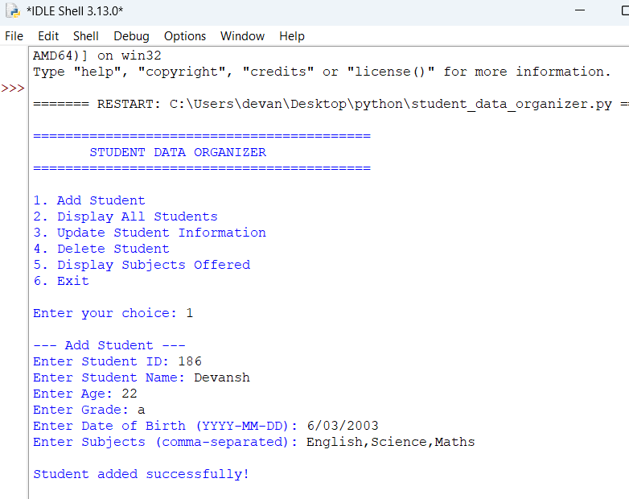
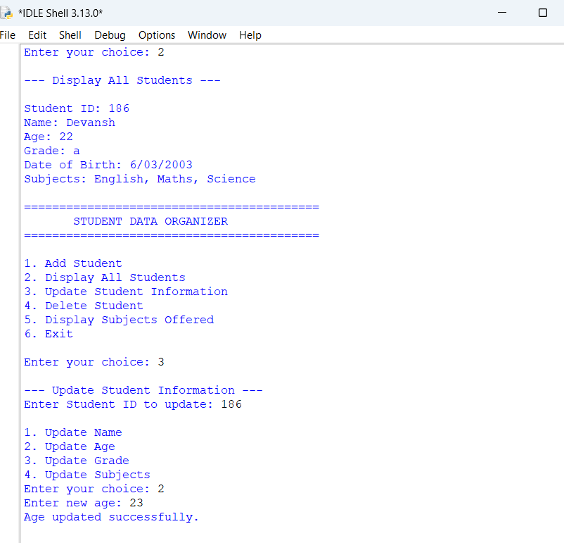
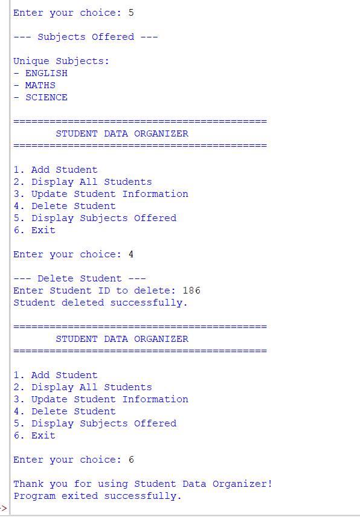

# Student Data Organizer

## Project: Collection Manipulator

Student Data Organizer is a Python-based console application developed to manage student records using different Python collection data types.

The project demonstrates the practical use of Lists, Tuples, Sets, Dictionaries, String Formatting, String Manipulation, Mutability, Immutability, Type Casting, and the `del` keyword.

## Objective

The main objective of this project is to create a simple menu-driven application that allows users to add, display, update, and delete student records.

The project also demonstrates how different Python collection types can be combined to store and manage structured student information.

## Features

The application provides the following options:

1. Add Student
2. Display All Students
3. Update Student Information
4. Delete Student
5. Display Subjects Offered
6. Exit

## Python Concepts Used

### List

A List is used to store multiple student records.

### Tuple

A Tuple is used to store the Student ID and Date of Birth.

### Set

A Set is used to store student subjects.

### Dictionary

A Dictionary is used to store the complete information of each student.

It stores:
- Student ID
- Name
- Age
- Grade
- Date of Birth
- Subjects

### String Formatting and Manipulation

The program uses f-strings to display student information in a clear format.

It also uses the following string methods:
- split()
- strip()
- join()

These methods are used to process and format subject information.

### Mutability

Lists and dictionaries are mutable. The program demonstrates mutability by allowing the user to update student name, age, grade, and subjects.

### Immutability

Student ID and Date of Birth are stored inside a Tuple. Since a Tuple is immutable, these values cannot be changed through the update options.

### Type Casting

The int() function is used to convert Student ID and Age from string input into integers.

### del Keyword

The del keyword is used to delete a student record from the main List.
## Program Flow
### Add Student

The user enters Student ID, Name, Age, Grade, Date of Birth, and Subjects. The information is stored using different Python collection types.

### Display All Students

Displays all stored student records in a formatted manner.

### Update Student Information

The user enters the Student ID and can update:

- Name
- Age
- Grade
- Subjects
- Delete Student

The user enters the Student ID. The matching student record is removed from the List using the del keyword.

### Display Subjects Offered

The program collects subjects from all students and displays only unique subjects.

### Exit

The program displays a thank-you message and exits.

## Program Output Screenshots

### Add Student

This screenshot shows the process of adding a new student record.

### Display and Update Student

This screenshot shows the display and update student operations.

### Delete, Display Subjects and Exit

This screenshot shows the delete student, display unique subjects, and exit operations.

## Conclusion

The Student Data Organizer demonstrates the practical use of Python collection types and basic programming concepts in a simple menu-driven application.

The project provides hands-on implementation of Lists, Tuples, Sets, Dictionaries, String Formatting, String Manipulation, Mutability, Immutability, Type Casting, and the del keyword.
